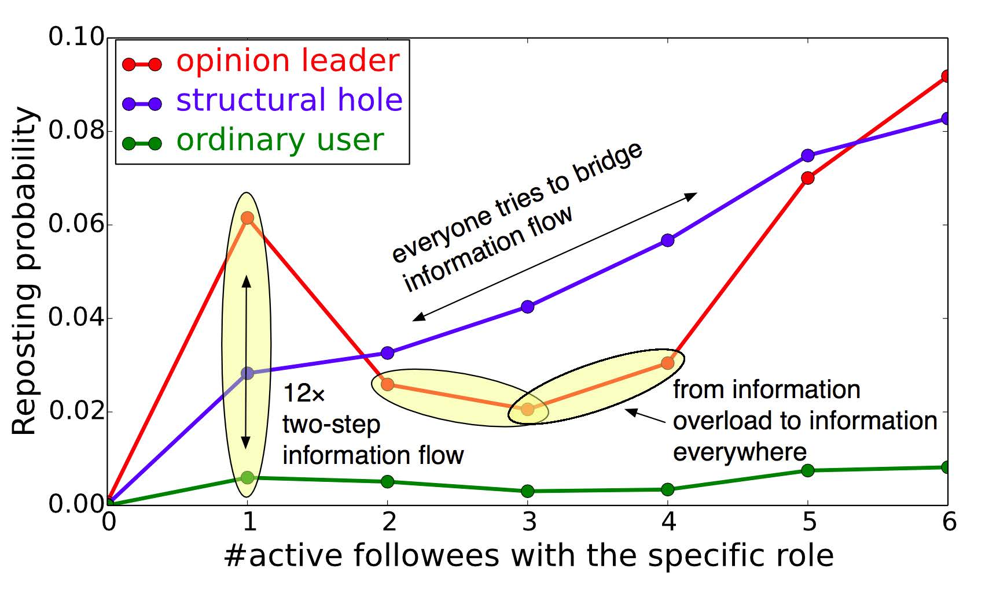

# Selected Research Work

<table border="1" cellpadding="1" cellspacing="1" width="95%" style="margin-top: 0px; border:0px solid #006699;">
<tr bgcolor="darkblue">
    <th colspan="2" align="left">* Social Influence</th>
</tr>
                    <tr>
                      <td width=320>
                      </td>
                      <td>Social influence occurs when one's opinions, emotions, or behaviors are affected by others, intentionally or unintentionally. There are three major research topics in social influence: test, measure, and model.  
                      &nbsp;&nbsp;&nbsp;
                      Our research mainly focuses on quantifying the influential strength between users in large social networks. We try to answer several challenging questions: (1) How to differentiate the social influences from different angles(topics)? (2) How to quantify the strength of those social influences? (3) How to estimate the model on real large networks?                        
                      &nbsp;&nbsp;&nbsp;
                      We propose Topical Affinity Propagation (TAP) to model the topic-level social influence on large networks (<a href="publications/KDD09-Tang-et-al-Social-Influence-Analysis.pdf">Tang et al., KDD'09</a>) and investigate a new problem of conformity influence analysis (<a href="publications/KDD13-Tang-et-al-Conformity-Influence.pdf">Tang et al., KDD'13</a>). 
                      We also study the conservative and non-conservative influence propagation over heterogeneous networks (<a href="publications/DMKD12-Liu-Tang-et-al-Learning-Influence-from-Heterogeneous-Social-Networks.pdf">Liu et al., DMKD'12</a>) and propose the notion of social influence locality for modeling retweeting behaviors (<a href="publications/IJCAI13-Zhang-et-al-social-influence-locality.pdf">Zhang et al., IJCAI'13</a>).
                      We further propose a NTT-FGM model to formalize social influence, correlation (homophily), and users' action dependency into a unified approach and distinguish their effects for modeling and predicting users' actions in social networks (<a href="publications/KDD10-Tan-et-al-social-action-tracking.pdf">Tan et al., KDD'10</a>). And apply social influence for analyzing user-level sentiment in social networks (<a href="publications/KDD11-Tan-et-al-social-user-sentiment-analysis.pdf">Tan et al., KDD'11</a>). 
                       
                      <b>Related data sets and codes: </b>
                      [<a href="http://arnetminer.org/lab-datasets/soinf/">Topic-Influence</a>]&nbsp;
                      [<a href="http://arnetminer.org/heterinf/">Influence-over-Heterogeneous-Networks</a>]&nbsp;
                      [<a href="http://arnetminer.org/stnt/">Social-Action-Tracking</a>] 
                      <b>Tutorials</b> are given at <a href="http://www2014.org">WWW'14</a>, <a href="http://www.wsdm2013.org/">WSDM'13</a> and <a href="http://www.asonam2012.etu.edu.tr/">ASONAM'12</a>, and can be downloaded here
                      [<a href="publications/WWW14-tutorial-social-influence-analysis.pptx">Slides</a>]
                      [<a href="publications/WWW14-tutorial-social-influence-analysis.pdf">PDF</a>]. 
                      <b>A survey</b> of models and algorithms for social influence analysis can be found <a href="publications/social-influence-analysis.pdf">here</a>.
                      </td>
                    </tr>
</table>

    

        <h2>Selected Research Work</h2>
    

    

    

        <h4>RAIN: Social Role-Aware Information Diffusion (AAAI'15)</h4>
        
Yang Yang, Jie Tang, Cane Wing-ki Leung, Yizhou Sun, Qicong Chen, Juanzi Li, and Qiang Yang

    

    

    
<small>Information diffusion, which studies how information is propagated in social networks, has attracted considerable research effort recently. However, most existing approaches do not distinguish between different social roles that nodes may play in the diffusion process.</small>

    
<small>We study the interplay between users’ social roles and their influence on information diffusion. In particular, we propose a generative model that integrates social role extraction and diffusion modeling into a unified framework. We then estimate the unknown parameters of the proposed model based on historical diffusion data. The proposed model can be applied in several scenarios. For instance, at the micro-level, the proposed model can be used to predict whether a user will repost a given message; while at the macro-level, it is able to predict both the scale and the duration of a diffusion process. We evaluate the proposed model on a real social media data set. Compared with several alternative methods, our model shows better performance in both micro- and macro-level prediction tasks.</small>

    
Paper:<a href="works/roleaware/roleaware.pdf" style="margin-left:-3px; margin-right: 3px;">roleaware.pdf</a> | Data: <a href="http://arnetminer.org/rain#b2967" style="margin-left:-3px; margin-right: 3px;">Details</a>

# Research Projects

## [OpenTuner]
[OpenTuner] is an extensible framework for building domain-specific
multi-objective program autotuners. OpenTuner supports fully customizable
configuration representations, an extensible technique representation to
allow for domain-specific techniques, and an easy to use interface for
communicating with the tuned program.

## [PetaBricks]
[PetaBricks] is a language and compiler where algorithmic choices are
exposed explicitly to create programs that define a search space of possible
algorithms.  The PetaBricks compiler then uses empirical autotuning to search
over these algorithms for an optimal version.

## [Kendo]
[Kendo] is a library that allows multithreaded programs, that would
normally produce nondeterministic output, to execute deterministically by
enforcing a dynamically computed and efficient ordering of lock acquisitions.

## [DMTCP]

[DMTCP][DMTCP] (Distributed MultiThreaded Checkpointing) is a tool to transparently
checkpoint and restart the state of a distributed cluster computation that
communicates through MPI or sockets.  It works on unmodified binaries at
the user level.

# Side Projects

## [LendingClubChecker]

[LendingClubChecker] is a python script to perform automated trading on the
peer to peer lending site Lending Club.


## [ShowDB]

[ShowDB] is a script to index and automatically download TV shows with
Bit Torrent.


# Open Source Contributions

While at Google I added support for sandboxing self-modifying code to Native
Client (part of Google Chrome).  I have also submitted bug fixes and minor
enhancements to a number of other open source projects.

[ShowDB]: https://github.com/jansel/showdb
[LendingClubChecker]: https://github.com/jansel/lendingclubchecker
[OpenTuner]: http://opentuner.org/
[PetaBricks]: http://projects.csail.mit.edu/petabricks/
[Kendo]: http://projects.csail.mit.edu/kendo/
[DMTCP]: http://dmtcp.sourceforge.net/

